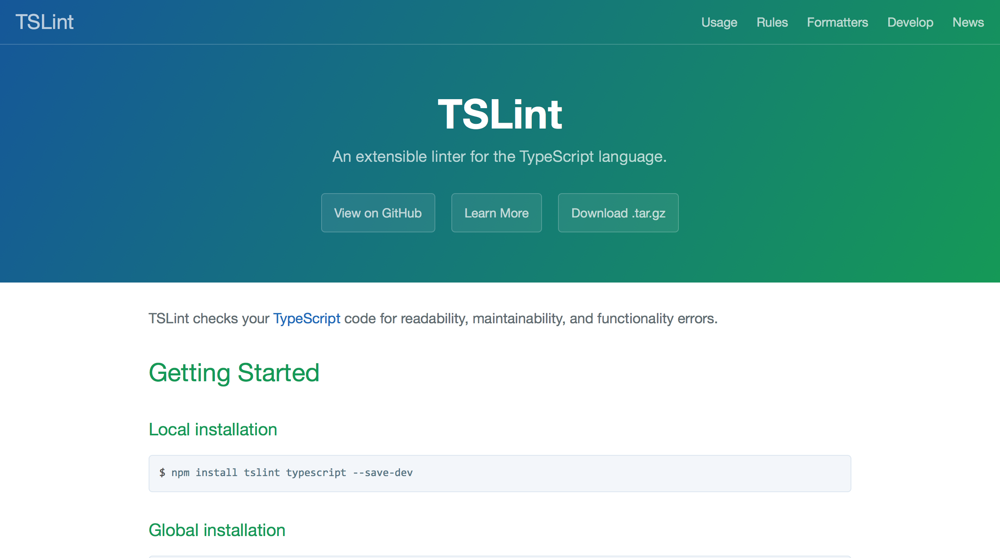
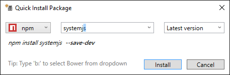

^ 

##**Typescript**: A stitch in time saves nine

####Gianluca Carucci @rucka
####gianluca.carucci.org


---
####*jobs:*
####Software Engineer@Hyperfair inc **&** Agile coach@Managed Designs

#### *communities:*
#### Ugidotnet **|** Scala Milano Meetup

#### *slide & code:* 
#### https://github.com/rucka


---
###**1 October 2012**


---

#? == Typescript

---

#WEB + ? == Typescript

---

#WEB + C# == Typescript
#?

---
##Non-Goal (cut) [^1]

- Exactly mimic the design of existing languages. Instead, use the behavior of JavaScript and the intentions of program authors as a guide for what makes the most sense in the language

[^1]: https://github.com/Microsoft/TypeScript/wiki/TypeScript-Design-Goals

---
##**Non**-Goal (cut) [^1]

- Exactly **mimic** the design of **existing languages**. Instead, **use the behavior of JavaScript** and the intentions of program authors as a guide for what makes the most sense in the language

---
## Goals (cut) [^1]
 - Align with current and future ECMAScript proposals.
 - Use a consistent, fully erasable, structural type system.

---
## Goals (cut) [^1]

 - **Align with** current and future **ECMAScript** proposals.
 - Use a consistent, fully erasable, **structural type system**.

---
#####Use a consistent, fully erasable, **structural type system**


---
###Use a consistent, fully erasable, **structural type system**


---

##Use a consistent, fully erasable, **structural type system**


---
# **Structural type system**


---


---
<br>
<br>
<br>
<br>
<br>
#*aka*


---

#example

```csharp
class Foo {public string me;}
class Bar {public string me;}

Foo foo = new Foo(){me = "foo"};
Bar bar = foo; //<--
               //Error:
               //cannot implicit convert
               //type 'Foo' to 'Bar'
System.Console.WriteLine("I am "+ bar.me);

```


---

#example

```typescript
interface Foo { me: string }
interface Bar { me: string }

const foo: Foo = { me: 'foo' }
const bar: Bar = foo

console.log(`I am ${bar.me}`); //I am foo
```


---

#~~WEB + C# == Typescript~~

---

#Demo

#### Visual Studio 2015 **<3** Typescript


---


---

#Let's **play** with **types**


---
## Goals (cut) [^1]
- **Statically identify** constructs that are likely to be **errors**.

---

##1. parametric polimorphism[^2]

```ts
interface Valid<A> { a: A }
interface Invalid<E> { errors: E[] }

function save<A>(data: Valid<A>): void {
    alert(`${JSON.stringfy(data.a)} saved!`);
}

function showErrors<E>(data: Invalid<E>): void {
    alert(`${JSON.stringfy(data.errors)} :(`);
}
```


[^2]: https://en.wikipedia.org/wiki/Parametric_polymorphism

---

##2. union types

```ts
type Validated<E, A> = Valid<A> | Invalid<E>
```

---

##3.1 discriminated (tagged) union

```ts
function isValid<A>(arg: any): arg is Valid<A> {
	return arg.a !== undefined;
}

// here validatedCustomer is Validated<E, Customer>
if (isValid(validatedCustomer)) { 
	// here validatedCustomer is Valid<Customer>
	return save(validatedCustomer); 
} else {
	// here validatedCustomer is Invalid<E>
	return showErrors(validatedCustomer);
}

```

---

##3.2 discriminated (tagged) union

```ts
interface NameIsTooShort { kind: 'NameIsTooShort', name: string }
interface VatCodeNotValid { kind: 'VatCodeNotValid', vatcode: string }
interface EmailIsNotValid { kind: 'EmailIsNotValid', email: string }
interface WebsiteUrlNotValid { kind: 'WebsiteUrlNotValid', url: string }

type CustomerError = NameIsTooShort | VatCodeNotValid | EmailIsNotValid | WebsiteUrlNotValid

function errorMessage(e: CustomerError): string {
    switch (e.kind) {
        case 'NameIsTooShort': 
        	return `Name must be at least 3 chars long, actual is ${e.name.length}`;
        case 'EmailIsNotValid': 
        	return `Email address '${e.email}' is not valid`;
        case 'VatCodeNotValid': 
        	return `VAT code '${e.vatcode}' is not valid`;
        case 'WebsiteUrlNotValid': 
        	return `Url '${e.url}' is not valid`;
    }
}
```
---

##4. itersection types

```ts
type A = {a: number}
type B = {b: number}
type I = A & B
let x: I = {a: 1, b: 2}; // OK
x = {a: 1, c: "three"}; // 	Error:
// Object literal may only specify known properties, 
// and 'c' does not exist in type 'I'.
```

---
#Demo

#### **Fun**(ctional) **validation**


---

#### using Functional programming
### you are still **alive**
#### (maybe)


---

## under the hood...


---

### Algebraic data type[^3]
####(*aka* ADT)


[^3]: https://en.wikipedia.org/wiki/Algebraic_data_type

---

##Functor[^4]


[^4]: https://en.wikipedia.org/wiki/Functor

---

####(*a sort of*) 
##Monad[^5]


[^5]: https://en.wikipedia.org/wiki/Monad_(functional_programming)

---

####(*a sort of*) 
##Applicative[^6]


[^6]: https://en.wikipedia.org/wiki/Applicative_functor

---

#homework


---

###update to typescript **2.0**


---

###use a custom **ts.config**


---

###enable 
### `--strictNullChecks` 
###flag


---

###use **tslint** 



---

###prefer **modules** over namespaces


---

###use an **asset manager** like Grunt, Gulp or Webpack


---

###prefer **Npm** over Nuget[^6] 
####(to manage your the assets)



[^6]: that's the only way to manage typescript dependecies with ASP.NET core: http://www.typescriptlang.org/docs/handbook/asp-net-core.html

---

###the right tool 
###for 
###the right job


---

<br>
#questions?


---

